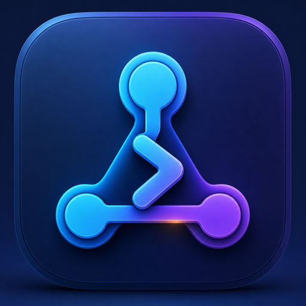
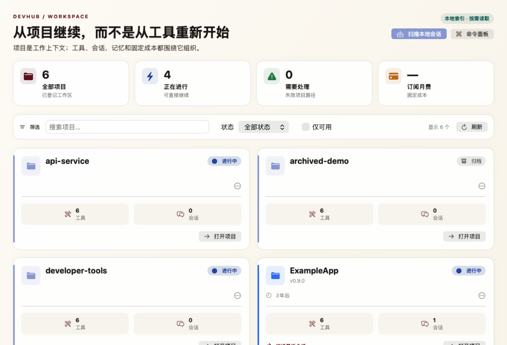
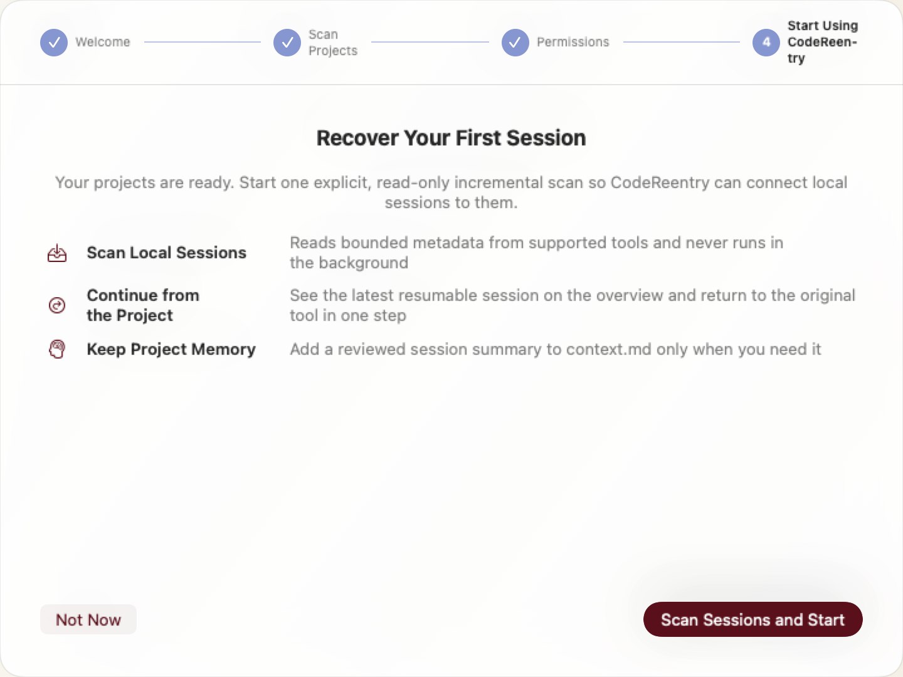
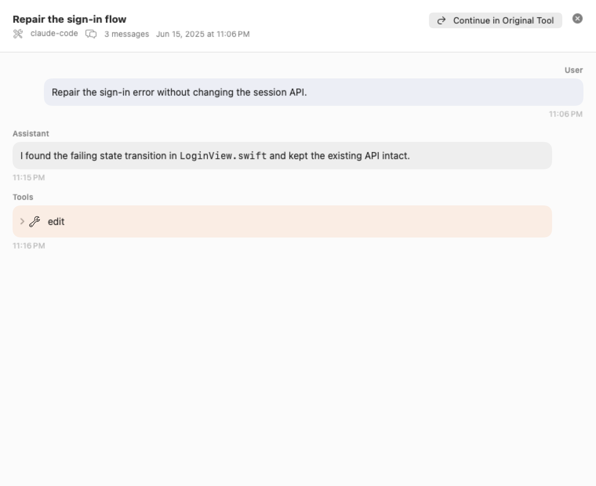
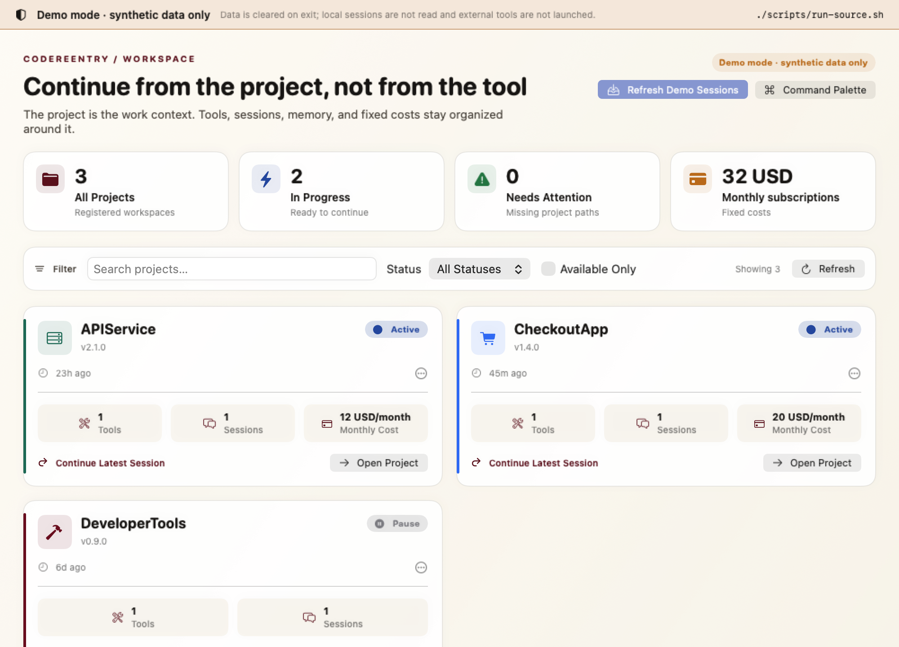

<p align="center">
  
</p>

<h1 align="center">CodeReentry</h1>

<p align="center"><strong>从项目继续，而不是从工具重新开始。</strong></p>

<p align="center">
  一个原生、本地优先的 macOS 项目恢复台：找回历史会话、保存项目记忆，
  并用正确的上下文重新打开正确的开发工具。
</p>

<p align="center">
  <a href="README.md">English</a> ·
  <a href="https://github.com/roooooly/CodeReentry/releases">源码 Beta</a> ·
  <a href="#从源码运行">从源码运行</a> ·
  <a href="PRIVACY.md">隐私边界</a> ·
  <a href="ROADMAP.md">路线图</a> ·
  <a href="CONTRIBUTING.md">参与贡献</a>
</p>

<p align="center">
  <a href="https://github.com/roooooly/CodeReentry/actions/workflows/ci.yml"></a>
  <a href="https://github.com/roooooly/CodeReentry/releases"></a>
  
  
  
  <a href="LICENSE"></a>
</p>

> **源码 Beta：**当前源码版本为 v0.6.1。CodeReentry 暂时没有经过 Developer ID 签名和
> Apple 公证的公开安装包。
> 当前请从源码构建体验，不要安装非官方镜像提供的二进制文件。只有满足
> [RELEASE.md](RELEASE.md) 中的签名与公证条件后，才会提供公开下载。



_截图中的项目、路径和数据均为合成测试数据。CodeReentry 内置简体中文与英文界面。_

## 看清恢复流程

CodeReentry 不会在后台扫描会话历史。你需要主动开始本地扫描；随后可以限量查看会话正文，
并在原工具支持恢复时，继续这一条精确会话。

| 1. 主动开始并确认本地扫描 | 2. 查看上下文并继续 |
| --- | --- |
|  |  |

_两个界面均由合成测试数据渲染。原始会话文件只按只读方式处理；应用只保存自己的本地索引，
以及用户主动写入的项目记忆。_

## CodeReentry 聚焦的问题

同时维护多个本地项目、使用多个 AI 编程工具时，启动一个工具并不难；真正昂贵的是
找回**正确的项目、会话和工作上下文**。CodeReentry 把项目作为稳定的工作单位：

1. 注册本地项目，不把源代码复制进 CodeReentry。
2. 由用户触发，轻量索引受支持工具的本地会话记录。
3. 在受限范围内查看会话正文，或回到原工具继续工作。
4. 由用户主动把会话总结写入项目记忆，为下一次交接保留上下文。CodeReentry 会记录来源；
   若存在更新会话，再次发送前会明确提醒。

CodeReentry 面向同时维护多个本地仓库、使用多个开发工具的独立开发者和小团队。它不是
云端会话托管服务，也不宣称可以在不同工具之间无损迁移完整对话。

项目使用一套[隐私安全的真实复访协议](docs/reentry-validation.md)验证恢复假设。工程测试
不能替代用户证据；在真实试验达标前，项目不会宣称恢复流程已经得到验证。
Release 性能另用[可复现的合成基线](docs/performance-baseline.md)跟踪，未达标结果也会保留。

## 当前能力

- 项目总览、状态、标签、Git 状态、脚本识别和快速启动
- 会话优先引导：先从本地 cwd 元数据提出项目根目录，确认后才注册
- 聚合 Claude Code、Codex、ZCode、Gemini CLI、GitHub Copilot CLI、OpenCode 的
  本地会话，以及 Kimi 状态元数据
- 面向大型 JSONL 历史记录的流式、限量读取
- 按需加载会话正文，并在工具支持时回到原会话
- 从会话详情显式启动本地恢复测量，用隐私安全的证据页汇总结果；不记录项目名、路径、
  会话 ID、提示词或正文；结果表单不计入耗时，且用户可随时清空本地证据
- 受保护的一键恢复：选择最近一条真正可用的会话，在会话子目录移动后安全回退到项目根目录，
  并严格使用用户保存的工具启动命令
- 可恢复的 Terminal 启动失败：macOS 拒绝 Automation 权限时，可复制只含安全转义脚本路径的
  一次性命令，不把会话 ID、项目记忆或环境变量写入剪贴板
- 项目级稳定上下文，以及带来源记录和过期保护的会话总结
- 本地估算 Claude Code、Codex 用量，与固定订阅费用分开显示
- 脚本插件与 MCP 服务器的显式权限检查
- 原生设置、明暗主题、简体中文与英文
- 不在后台遍历完整会话历史

### 工具兼容情况

| 工具 | 本地会话发现 | CodeReentry 内查看正文 | 继续或打开 | 项目记忆交接 |
| --- | --- | --- | --- | --- |
| Claude Code | 支持 | 按需、限量读取 | 恢复会话 | 追加系统提示文件 |
| Codex | 支持 | 按需、限量读取 | 恢复会话 | 作为新用户消息发送 |
| ZCode | 支持 | 支持已适配的本地记录 | 恢复会话 | 通过提示参数传递 |
| Kimi | 仅状态元数据 | 不支持 | 打开应用，不能定位到该会话 | 不支持 |
| OpenCode | 支持（v1.18.19 SQLite） | 按需、限量读取 | 精确恢复会话（`--session`） | 通过提示参数传递 |
| Gemini CLI | 支持（项目级 JSONL） | 按需、限量读取 | 精确恢复会话（`--resume`） | 不支持 |
| GitHub Copilot CLI | 支持（`session-state` 事件） | 按需、限量读取 | 按完整 ID 恢复（`--resume`） | 不支持 |
| VS Code | 不适用 | 不适用 | 打开项目 | 用户确认后通过剪贴板辅助 |

表格描述的是当前源码已经实现的路径。第三方工具的存储格式和命令行行为可能变化，
兼容性修改必须同时提供脱敏测试样本和版本说明。

OpenCode 兼容性以[兼容性说明](docs/opencode-compatibility.md)中固定的上游源码为验证基准。
CodeReentry 从默认的 `~/.local/share/opencode/opencode.db`、`OPENCODE_DB` 自定义路径以及
有上限的 `opencode-<channel>.db` 同级数据库发现会话元数据。数据库会先校验结构，再以
只读方式打开；每个数据库最多索引最近 1,000 个未归档会话，发现阶段不读取消息正文。
用户打开对话后，只读取指定会话，并限制消息数、片段数、单条 JSON 和总字符数；推理内容
与非对话执行记录不会进入 CodeReentry 的正文视图。

Gemini CLI 兼容性以[兼容性说明](docs/gemini-cli-compatibility.md)中记录的上游源码快照为
验证基准。CodeReentry 只依据 Gemini CLI 的 `.project_root` 标记或 `projects.json` 注册表
确定项目归属，应用回退和检查点记录，排除子代理历史，并使用完整会话 UUID 恢复。发现与
正文加载都设置了目录、文件、字节、单行、消息和字符上限；遇到超大的内联数据时会跳过并
标记为截断，而不是无上限载入内存。

GitHub Copilot CLI 兼容性以[兼容性说明](docs/github-copilot-cli-compatibility.md)中固定的
官方文档与 CLI 快照为验证基准。CodeReentry 只读取官方记录的主代理消息与项目上下文事件，
排除推理、系统提示、流式增量、子代理事件和符号链接，并使用发现到的完整会话 ID 恢复。
开发测试使用合成记录，不作为真实用户恢复试验的证据。

## 隐私边界

CodeReentry 的设计目标是让项目与会话数据留在 Mac 上。

- 不包含遥测或分析 SDK。
- 会话发现以元数据为先；只有打开会话时才加载消息正文。
- 原始会话文件按只读方式处理。
- 工具凭据保存在 macOS 钥匙串中，备份不包含凭据值。
- 诊断导出必须由用户主动触发，只包含 CodeReentry 日志，并遮罩常见凭据格式。
- 仓库检查会拦截本地数据库、历史文件、私人路径、签名文件和常见密钥格式。

完整说明见 [PRIVACY.md](PRIVACY.md)。安全问题请按照 [SECURITY.md](SECURITY.md)
提供的私密渠道报告。

## 从源码运行

需要：

- macOS 14 或更高版本
- 支持 Swift 6 的 Xcode

克隆后用一个命令完成本机临时签名构建、校验并启动：

```bash
git clone https://github.com/roooooly/CodeReentry.git
cd CodeReentry
./scripts/run-source.sh
```

如果想在允许访问自己的项目与会话之前先看清完整流程，可以启动隔离演示：

```bash
./scripts/run-source.sh --demo
```

如果需要长期使用，可以把已校验的本地构建安装到当前用户目录后启动：

```bash
./scripts/run-source.sh --install
```

该命令只写入 `~/Applications/CodeReentry.app`，不需要管理员权限。只有当同名项目是
真实目录且 bundle identifier 与 CodeReentry 完全一致时才会替换；新副本会先暂存并校验，
移动失败则恢复旧副本。这仍是从你的本地检出内容构建的应用，不是从 Release 下载的未签名
二进制文件。

演示模式使用内存数据库，并在可随时清除的临时目录中提供合成项目、对话、记忆和订阅数据。
它不会读取本机会话、启动 MCP 服务、扫描用量文件、打开开发工具，也不会写入 CodeReentry
的正式数据库；退出应用时会删除临时工作区。



脚本直接使用仓库已提交的 Xcode 工程，只把构建产物写入已忽略的 `build/` 目录，
会先校验应用包；除非你在应用内主动操作，否则不会扫描项目或会话。传入
`--build-only` 可以只构建、不启动；与 `--install` 组合时会安装但不启动。首次构建需要
解析和编译 Swift 依赖，可能需要几分钟。

CI 还会在 Apple Silicon 上交叉编译并校验 Intel slice。你可以运行
`CODEREENTRY_BUILD_ARCH=x86_64 ./scripts/run-source.sh --build-only` 执行同样的编译检查。
这只能证明当前源码和依赖能够产出 `x86_64` 应用包，不能替代
[issue #4](https://github.com/roooooly/CodeReentry/issues/4) 所需的 Intel 真机运行验证。

首次启动时，选择**从会话发现项目**是获得价值最短的路径。CodeReentry 只在你点击后
执行一次元数据扫描，最多提出 20 个最近项目根目录，并在注册任何内容前等待确认。
如果更愿意按目录设置，仍可选择**手动选择目录**。

如果要在 Xcode 中开发，请安装 [XcodeGen](https://github.com/yonaskolb/XcodeGen)，
运行 `xcodegen generate` 后打开 `DevHub.xcodeproj`。工程由 `project.yml` 生成；修改
工程设置或资源时，应先更新该文件，再重新生成。

## 验证检出内容

```bash
./scripts/privacy-audit.sh
./scripts/test-performance-summary.sh
swift test --package-path DevHubPackage
xcodebuild \
  -project DevHub.xcodeproj \
  -scheme DevHub \
  -destination 'platform=macOS' \
  test CODE_SIGNING_ALLOWED=NO
```

如果只需要制作本机临时签名的评估包，请阅读 [RELEASE.md](RELEASE.md)。这个流程与公开
分发严格分开。

## 参与贡献

请先阅读 [CONTRIBUTING.md](CONTRIBUTING.md)、公开[路线图](ROADMAP.md)，或选择一个
范围清楚的 Issue。测试和文档只能使用合成的项目名、路径、会话、截图和凭据。

使用问题和设计提案请进入
[Discussions](https://github.com/roooooly/CodeReentry/discussions)；可以复现的缺陷和已确认工作
请使用 Issues。

## 许可证

CodeReentry 使用 [MIT License](LICENSE)。
